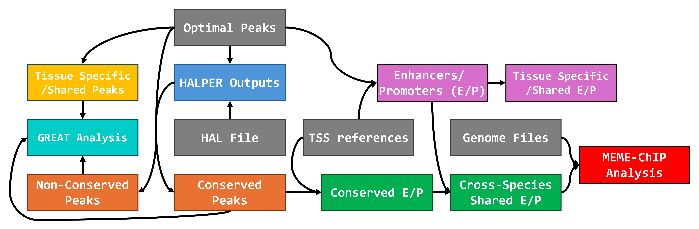

# Cross-Species and Cross-Tissue Chromatin Accessibility Analysis Pipeline

This project provides a pipeline for comparing chromatin accessibility data (e.g., ATAC-seq peaks) across different species and tissues. It leverages HALPER for ortholog mapping and performs downstream analyses including: (1) identification of conserved vs. species-specific regulatory elements, (2) detection of tissue-shared vs. tissue-specific regions, (3) classification and comparison of enhancers vs. promoters within and across species, and (4) functional enrichment analysis of identified regulatory elements. Here is a 37-second demo video of the pipeline: 🎥 [Project Demo Video](https://youtu.be/aQjV1WrcCD0)

## 0. Folder Structure

```plaintext
project_root/
├── main.py                   # Main pipeline execution script
├── config.yaml               # Configuration file with paths and pipeline settings
├── pipeline/                 # Core pipeline modules
│   ├── __init__.py           # Package initialization and imports
│   ├── halper.py                           # Step 1: HALPER ortholog mapping implementation
│   ├── bedtool_preprocess.py               # Step 2: Preprocessing files for downstream analysis
│   ├── cross_species_open_vs_closed.py     # Step 3: Cross-species open vs closed regions analysis
│   ├── cross_tissues_shared_vs_specific.py # Step 4: Cross-tissues shared vs specific regions
│   ├── cross_tissues_enhancer_promoter.py  # Step 5: Cross-tissues enhancer vs promoter analysis
│   ├── cross_species_enhancer_promoter.py  # Step 6: Cross-species enhancer vs promoter analysis
│   ├── meme_chip_analysis.py               # Step 7: Motif alignment and enrichment analysis
│   └── monitor.py            # Pipeline job monitoring utilities
├── archive/                  # Archive of development files and examples
│   └── *                     # Any files in this directory are not used in the final pipeline
├── meme-results/             # Results from MEME-ChIP
│   └── *                     # Any files in this directory are not used in the final pipeline
├── README.md                 # This file
└── .gitignore                # Git ignore file
```

## 1. Setup

This pipeline is designed to be run on a HPC cluster and is tested on the [PSC Bridges-2 cluster](https://www.psc.edu/resources/bridges-2/). You can run the main script directly on the login node without any modification. The pipeline will automatically setup jobs on the compute nodes for each step.

### 1.1. Clone the Repository

```bash
git clone https://github.com/yitianTracy/03713_final_project.git
cd 03713_final_project
```

### 1.2. Python Environment

Ensure you have Python 3.9 or later installed.

```bash
python --version
```

Install the required Python packages. These packages are installed by default on the PSC Bridges-2 cluster, so you may see messages like `Requirement already satisfied`.

```bash
pip install pyyaml tabulate pydantic
```

### 1.3. Install Required Tools

This pipeline relies on external bioinformatics tools. Please install them and ensure they are accessible in your system's PATH or provide the correct paths in the configuration file (`config.yaml`).

*   **HAL Tools:** Required for HALPER. Follow the official installation guide:
    *   🔗 [HAL installation instructions](https://github.com/pfenninglab/halLiftover-postprocessing/blob/master/hal_install_instructions.md)
*   **BedTools:** Used for genomic interval operations. Installation instructions can be found on the [BedTools website](https://bedtools.readthedocs.io/en/latest/content/installation.html).
*   **MEME-ChIP:** Used for comprehensive motif analysis. Installation instructions for different operating systems can be found on the [MEME-suite website](https://meme-suite.org/meme//doc/download.html)

MEME-ChIP is already installed on the PSC Bridges-2 cluster, so you typically don't need to install manually. If you are running this pipeline on a different cluster, you may also need to run the following command line prompts:

> Set-up an Anaconda (conda) environment, add channels to the environment and activate the environment using the following commands.
> ```bash
> conda create -n meme
> conda config --env --add channels defaults
> conda config --env --add channels bioconda
> conda config --env --add channels conda-forge
> conda activate meme
> ```
> 
> Download MEME suite in the established conda environment using the following commands (any version number of MEME suite can be downloaded with this command).
> ```bash
> conda install MEME-suite
> ```

## 2. Configuration (`config.yaml`)

The pipeline's behavior is controlled by the `config.yaml` file. Before running, you need to configure it according to your environment and input data.

Key sections:

*   **Base Settings:** Define the species and organs being compared (`species_1`, `species_2`, `organ_1`, `organ_2`) and a temporary directory (`temp_dir`).
*   **HALPER Settings:**
    *   `halper_script`: Path to the `halper_map_peak_orthologs.sh` script from the [halLiftover-postprocessing](https://github.com/pfenninglab/halLiftover-postprocessing) tool.
    *   `hal_file`: Path to the HAL alignment file containing the genomes of interest.
    *   `halper_output_dir`: Directory where HALPER mapping results will be saved.
    *   `species_*_organ_*_peak_file`: Paths to the input peak files (e.g., narrowPeak format) for each species-organ combination.
*   **Enhancers vs Promoters Pipeline Settings:**
    *   `species_*_TSS_file`: Paths to the Transcription Start Site (TSS) annotation files (BED format) for each species. Used to distinguish promoter regions from enhancers.
*   **Output Directories:** Specify output directories for various analysis steps (`bedtool_preprocess_output_dir`, `cross_species_open_vs_closed_output_dir`, etc.). These directories will be created if they don't exist.

**Note:** The configuration file includes commented-out sections for paths that are *automatically inferred* by the pipeline (e.g., specific HALPER output files and conserved files). You typically do not need to uncomment or modify these.

Make sure all paths to input files, scripts, and tools are correct for your system. Here is an example of the `config.yaml` file:

```yaml
# Base Settings
species_1: "Human"
species_2: "Mouse"
organ_1: "Pancreas"
organ_2: "Liver"
temp_dir: "/ocean/projects/bio230007p/can1/temp"

# HALPER Settings
halper_script: "/ocean/projects/bio230007p/can1/halLiftover-postprocessing/halper_map_peak_orthologs.sh"
hal_file: "/ocean/projects/bio230007p/ikaplow/Alignments/10plusway-master.hal"
halper_output_dir: "/ocean/projects/bio230007p/can1/output/halper"
species_1_organ_1_peak_file: "/ocean/projects/bio230007p/can1/s2_v2/human_pancreas.idr.optimal_peak.narrowPeak"
species_1_organ_2_peak_file: "/ocean/projects/bio230007p/can1/s2_v2/human_liver.idr.optimal_peak.narrowPeak"
species_2_organ_1_peak_file: "/ocean/projects/bio230007p/can1/s2_v2/mouse_pancreas.idr.optimal_peak.narrowPeak"
species_2_organ_2_peak_file: "/ocean/projects/bio230007p/can1/s2_v2/mouse_liver.idr.optimal_peak.narrowPeak"

# Enhancers vs promoters pipeline Settings
species_1_TSS_file: "/ocean/projects/bio230007p/ikaplow/HumanGenomeInfo/gencode.v27.annotation.protTranscript.TSSsWithStrand_sorted.bed"
species_2_TSS_file: "/ocean/projects/bio230007p/ikaplow/MouseGenomeInfo/gencode.vM15.annotation.protTranscript.geneNames_TSSWithStrand_sorted.bed"

# Bedtool preprocess Settings
bedtool_preprocess_output_dir: "/ocean/projects/bio230007p/can1/output/bedtool_preprocess"

# Cross-species ortholog open vs closed pipeline Settings
cross_species_open_vs_closed_output_dir: "/ocean/projects/bio230007p/can1/output/cross_species_open_vs_closed"

# Cross-tissues region shared vs specific pipeline Settings
cross_tissues_shared_vs_specific_output_dir: "/ocean/projects/bio230007p/can1/output/cross_tissues_shared_vs_specific"

# Within-species enhancers vs promoters pipeline Settings
cross_tissues_enhancers_vs_promoters_output_dir: "/ocean/projects/bio230007p/can1/output/cross_tissues_enhancers_vs_promoters"

# Cross-species enhancers vs promoters pipeline Settings
cross_species_enhancers_vs_promoters_output_dir: "/ocean/projects/bio230007p/can1/output/cross_species_enhancers_vs_promoters"

# MEME-chip Settings
meme_chip_output_dir: "/ocean/projects/bio230007p/can1/output/meme_chip"
species_1_genome_fasta: "/ocean/projects/bio230007p/can1/input/hg38.fa"
species_2_genome_fasta: "/ocean/projects/bio230007p/can1/input/mm10.fa"

# The following fields will be automatically generated by the pipeline
# Normally, you don't need to specify these fields
# If you want to manually specify the paths, you can do so by uncommenting the following lines

# ... (see the config.yaml file for more details)
```

## 3. Pipeline Execution

Run the entire pipeline using the main script with the default config file:

```bash
python main.py
```

Simply run the command in the **login node** and the pipeline will automatically setup jobs on the compute nodes for each step. Note that you may need to `module load python3` first.

### Command-line Options

You can see the available command-line options by running:

```bash
python main.py --help
```

You can specify the config file using the `--config` flag. The default is `config.yaml`. We included a sample config file in the repo for your convenience.

```bash
python main.py --config my_own_config.yaml
```

You can skip specific steps using command-line flags:

*   `--skip-step-1`: Skip running the HALPER pipeline (Step 1).
*   `--skip-step-3`: Skip running the cross-species open vs. closed analysis (Step 3).
*   `--skip-step-4`: Skip running the cross-tissues shared vs. specific analysis (Step 4).
*   `--skip-step-5`: Skip running the cross-tissues enhancer vs. promoter analysis (Step 5).
*   `--skip-step-6`: Skip running the cross-species enhancer vs. promoter analysis (Step 6).
*   `--skip-step-7`: Skip running the motif alignment (Step 7).

**Note:** Most of the steps are dependent on the output of the previous steps. If you skip a step, you should ensure that the output of the previous step exists and is correctly specified in the config file. Here is a diagram to help you understand the dependencies:



Example: Run only Step 2 and Step 3 (assuming Step 1 outputs exist):

```bash
python main.py --config config.yaml --skip-step-1 --skip-step-4 --skip-step-5 --skip-step-6 --skip-step-7
```

## 4. Pipeline Walkthrough

The `main.py` script executes the following steps sequentially:

### Step 1: HALPER Ortholog Mapping (`pipeline/halper.py`)
Maps regulatory elements (peaks) from one species to another using the HALPER tool. This step:
- Takes narrowPeak files from each species-tissue combination
- Runs the HALPER ortholog mapping algorithm to find orthologous regions across species
- Generates mapped peak files in the target species' genome coordinates
- Creates the foundation for all downstream cross-species analyses

*Estimated runtime: ~4 hours*

### Step 2: BedTools Preprocessing (`pipeline/bedtool_preprocess.py`)
Prepares the data for the downstream analyses by:
- Extracting coordinate information (first 3 columns) from the peak files
- Unzipping HALPER output files if needed
- Creating clean BED files for use in subsequent steps
- Updating the configuration with paths to these cleaned files

*Estimated runtime: < 30 seconds*

### Step 3: Cross-Species Ortholog Comparison (Open vs. Closed) (`pipeline/cross_species_open_vs_closed.py`)
Identifies conserved and species-specific regulatory elements by:
- Comparing orthologous regions mapped from one species to corresponding native peaks in the target species
- Classifying orthologous elements as "open" (conserved) if they overlap with native peaks in the target species
- Classifying orthologous elements as "closed" (species-specific) if they don't overlap with native peaks
- Generating statistics on conservation rates between species for each tissue

*Estimated runtime (excluding queuing time): < 30 seconds*

### Step 4: Cross-Tissue Comparison (Shared vs. Specific) (`pipeline/cross_tissues_shared_vs_specific.py`)
Examines tissue specificity of regulatory elements within each species by:
- Comparing peak sets between different tissues of the same species
- Identifying "shared" peaks that appear in both tissues
- Identifying "tissue-specific" peaks unique to each tissue
- Generating statistics on the proportion of shared versus tissue-specific elements

*Estimated runtime (excluding queuing time): < 30 seconds*

### Step 5: Cross-Tissue Comparison (Enhancer vs. Promoter) (`pipeline/cross_tissues_enhancer_promoter.py`)
Classifies regulatory elements by genomic context and examines their tissue specificity by:
- Using TSS (Transcription Start Site) annotations to classify peaks as either promoters (≤5000bp from TSS) or enhancers (>5000bp from TSS)
- Comparing the distribution of enhancers and promoters between tissues of the same species
- Identifying tissue-shared versus tissue-specific enhancers and promoters
- Generating statistics on the proportion of enhancers versus promoters in each tissue

*Estimated runtime (excluding queuing time): < 30 seconds*

### Step 6: Cross-Species Comparison (Enhancer vs. Promoter) (`pipeline/cross_species_enhancer_promoter.py`)
Examines the evolutionary conservation of different types of regulatory elements by:
- Classifying conserved (open) peaks identified in Step 3 as enhancers or promoters based on distance to TSS
- Comparing enhancer and promoter conservation rates between species
- Identifying elements that maintain the same classification (enhancer/promoter) across species
- Generating statistics on conservation patterns specific to enhancers versus promoters

*Estimated runtime (excluding queuing time): < 30 seconds*

### Step 7: Motif Alignment

Performs a comprehensive motif analysis on inputted nucleotide sequence data by: 
- Scanning open chromatin regions for motifs in conserved nucleotide regions across liver and pancreas tissue data for both human and mouse over promoter and enhancer regions
- Appropriately finding the motifs that occur in these OCRs significantly more than expected by chance
- Finding motifs that are typically centered around peak summits
- Running MEME, STREME, CENTRIMO, TOMTOM, FIMO and SPAMO to determine statistically significant motif alignments 

*Estimated runtime (excluding queuing time): < 3 hours*

### Additional Step: Functional Enrichment Analysis

We employed the GREAT (Genomic Regions Enrichment of Annotations Tool) to perform functional enrichment analysis of open chromatin regions. To run the enrichment analysis, users need to go to the [GREAT website](https://great.stanford.edu/) and upload corresponding BED files manually.

In our pipeline, we used the Mouse GRCm38 (UCSC mm10, December 2011) assembly as our reference genome. The output files from Step 4 were used as the input for the enrichment analysis to compare the enrichment of open chromatin regions that are conserved across tissues and specific to each tissue.

## 5. Outputs

Each pipeline step generates output files in the respective directories specified in `config.yaml`. Examine these directories after a successful run to find the results of each analysis (e.g., BED files, text tables). Error logs are also saved in the respective directories, with names ending in `*.err.txt`.

## 6. Citations

* ENCODE Project Consortium. "An integrated encyclopedia of DNA elements in the human genome." Nature 489.7414 (2012): 57.

* Zhang, Xiaoyu, et al. "HALPER facilitates the identification of regulatory element orthologs across species." Bioinformatics 36.15 (2020): 4339-4340.

* McLean, Cory Y., et al. "GREAT improves functional interpretation of cis-regulatory regions." Nature biotechnology 28.5 (2010): 495-501.

* Quinlan, Aaron R., and Ira M. Hall. "BEDTools: a flexible suite of utilities for comparing genomic features." Bioinformatics 26.6 (2010): 841-842.

* Bailey, Timothy L., et al. "MEME SUITE: tools for motif discovery and searching." Nucleic acids research 37.suppl_2 (2009): W202-W208.

## 7. Contributors

*   [Claude](https://github.com/AnJunHao)
*   [Isabella](https://github.com/iasalasallende)
*   [Shruthi](https://github.com/shruthirajaraman)
*   [Yitian](https://github.com/yitianTracy)